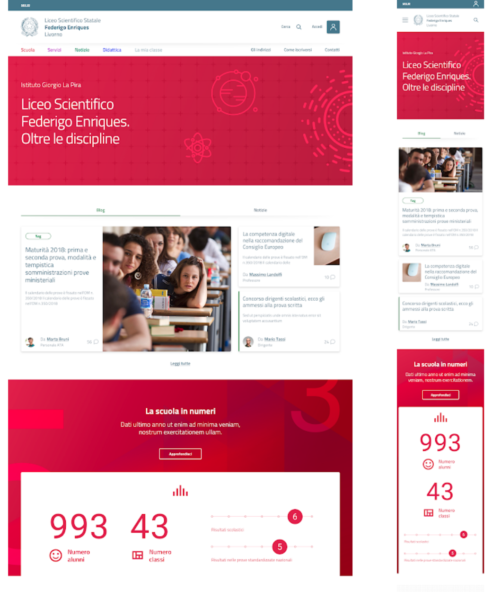
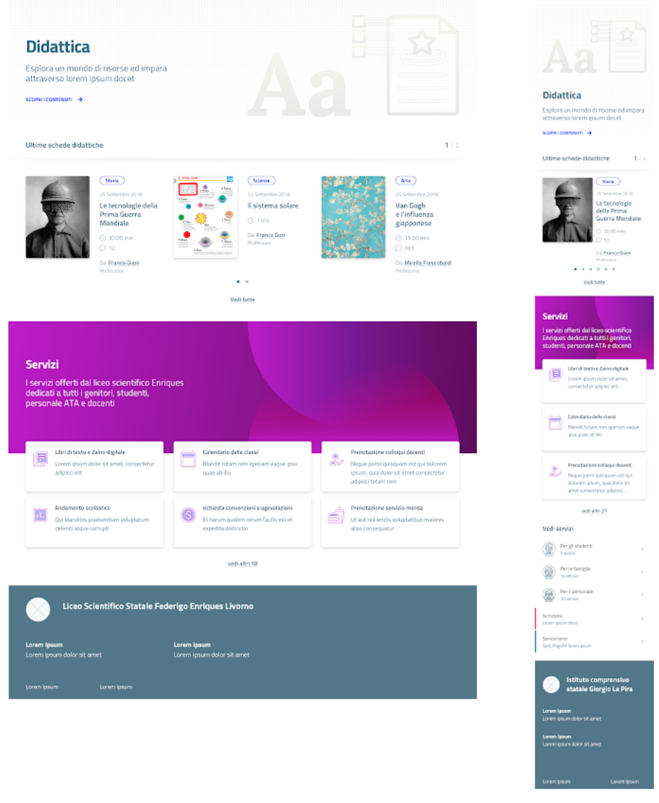
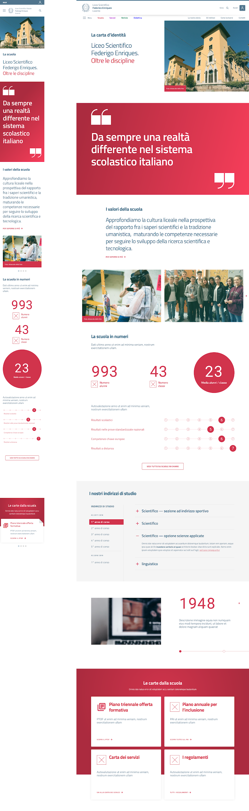
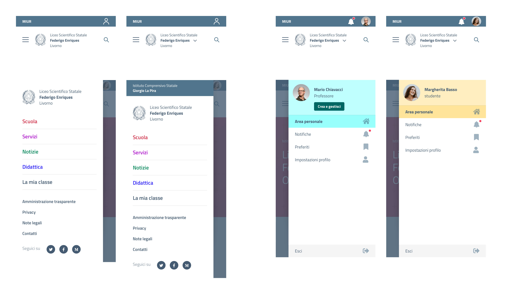
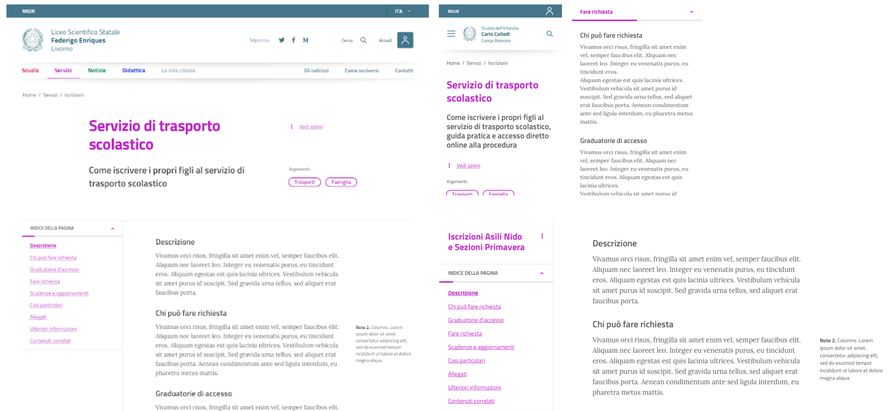

.. _progetto-grafico:

Il progetto grafico
==================

Il progetto grafico è stato costruito usando lo `UI kit di Designers
Italia <https://designers.italia.it/kit/ui-kit/>`__. 

   Esempio di home page del sito di una scuola, nella versione
   desktop (sinistra) e mobile (destra).

La progettazione delle pagine è *responsive*, *mobile-first* e a moduli, a
cominciare dalla *home page* (vedi :numref:`Figura %s <hp-hifi>`) e in tutte le 
altre sezioni del sito (vedi un esempio nella :numref:`Figura %s <hp-sez>`). 

L'uso dei colori nella carta d'identità della scuola permette di individuare
facilmente le quattro aree del sito. Come si vede dalla :numref:`Figura %s <hp-2>`, 
il design dei contenuti punta sulla semplicità e sulla chiarezza.

   Esempio di una sezione del sito nella versione desktop (sinistra) e mobile (destra).     
   

   Prototipo hi-fi del sito delle scuole (carta d'identità della
   scuola). A sinistra la versione mobile, a destra la versione desktop.
   L’uso di infografiche e la narrazione visiva permettono di essere efficaci e semplici.

L'impostazione del progetto di design comincia dal "branding", con una barra di
navigazione e degli header "universali", cioè coerenti nelle diverse visioni
(mobile e desktop) del sito (Figura :numref:`Figura %s <branding>`). Da qui è
possibile accedere alle cinque sezioni descritte in
:ref:`architettura-dellinformazione` e all'area personale. 

L'approccio è verso
la semplificazione, sia su desktop che su mobile, con un'attenzione particolare
alla consistenza di *look and feel* e di accesso all'informazione. L'uso di
colori accesi per le aree principali permette di "svecchiare" la burocrazia, di
pari passo con l’uso di un linguaggio meno burocratico. La :numref:`Figura %s
<branding>` mostra un esempio di branding e menu di navigazione nella versione
mobile.

Le pagine del sito hanno un indice di
pagina che permette di scorrere velocemente tra i paragrafi delle lunghe schede:
l’idea è quella di semplificare la lettura dei contenuti il più possibile (vedi
la :numref:`Figura %s <servizi>`). 

   Branding, menu di navigazione e menu dopo il login per
   mobile, nelle versioni per una scuola e per un istituto comprensivo.

   Pagina di descrizione dei servizi con un indice delle sezioni
   per semplificare la navigazione, nella versione desktop e mobile.

I prototipi sono stati sottoposti a un processo di validazione esperta da parte di designer e personale scolastico. I `risultati della validazione (PDF 103KB) <https://designers.italia.it/files/resources/modelli/scuole/ricerca/Scuole-D3SummaryReportValidazioneConcept.pdf>`_ hanno permesso di aggiornare e migliorare i prototipi.

